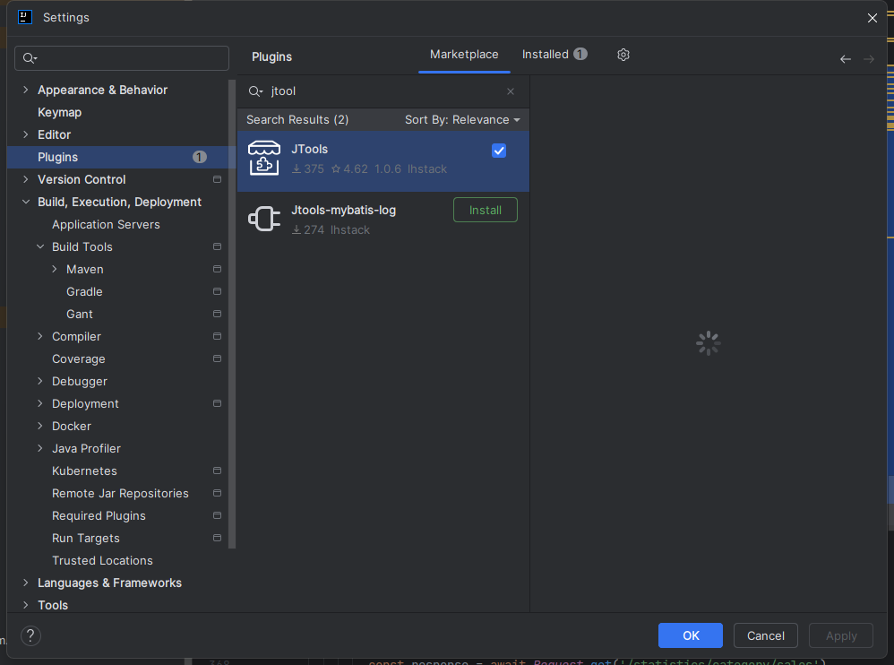
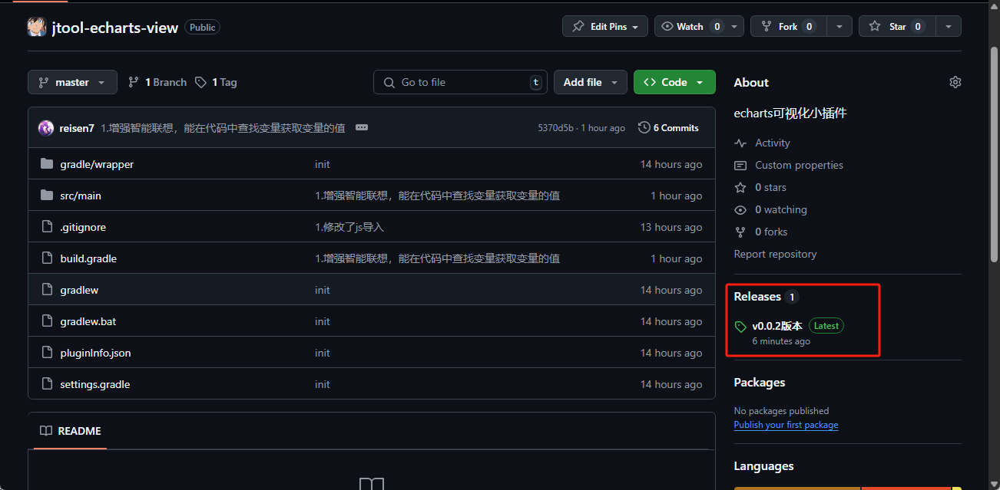
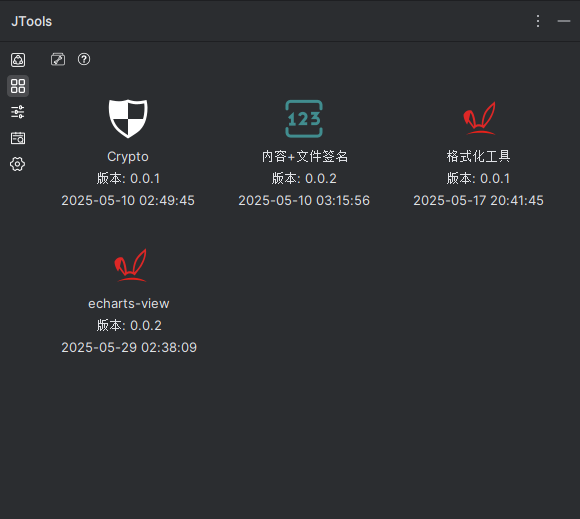
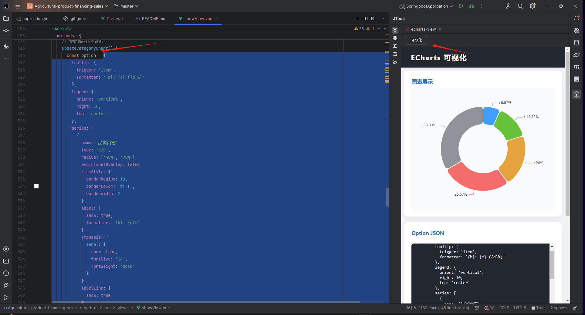
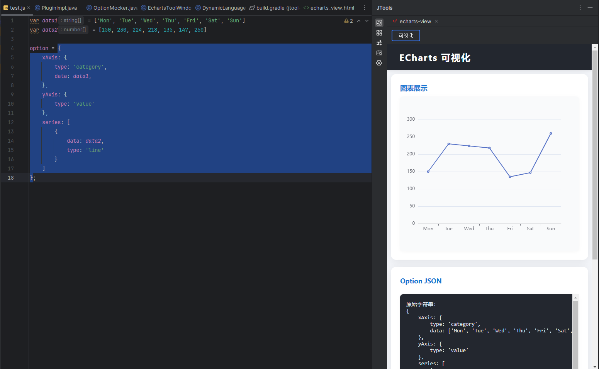

---

# ECharts View 可视化 IDEA 插件

本插件基于 JCEF，为 JetBrains IDEA 系列 IDE 提供 ECharts option 的一键可视化能力。支持自动 mock/清理 option 中的非法内容（如变量、表达式、函数等），让复杂 option 也能顺利渲染为图表，极大提升前端/数据可视化开发体验。

## 插件安装

在IDEA的插件市场安装Jtool

安装之后，在仓库地址里面下载jar包

> [https://github.com/jtools-plugins/jtool-echarts-view](https://github.com/jtools-plugins/jtool-echarts-view)




下载完成之后，导入jar包



jar包往这里面拖拽就行

## 插件使用
### 一般使用

在左边框选住echarts的option配置，插件右边点击可视化，即可查看图表的样式

### 变量自动获取


如上所示，data1与data2的变量的值，并未在选择框中，但是插件会进行全文索引，获取这两变量的值方便开发者进行调试，开发者只需要在意调试图表样式即可，其他的交给插件
## 功能特性

- **选区可视化**：在编辑器中选中 ECharts option（支持 JSON/JSON5/JS 对象），点击“可视化”按钮即可渲染图表。
- **智能 mock**：自动 mock/清理 option 里的 `data`、`formatter` 等字段的非法内容，支持变量查找和 mock 替换，最大程度保证 option 可被 JSON5 解析。
- **JCEF 内嵌渲染**：基于 JCEF 内嵌 ECharts 前端页面，支持丰富的交互和美观的图表展示。
- **兼容复杂 option**：支持 option 中存在变量、表达式、函数、this.xxx、new 表达式等复杂 JS 代码，自动降级为 mock 数据。
- **保留字符串 formatter**：只清理函数/表达式类型的 `formatter`，字符串类型的 formatter 会被保留。

## 安装与构建
### 环境要求

- IntelliJ IDEA 2022.3 及以上（推荐 2024.1+）
- JDK 17
- Gradle

### 构建插件

```bash
./gradlew build
```

生成的插件包位于 `build/libs/` 目录下，可直接在 IDEA 中安装。

### 运行/调试

1. 使用 IDEA 打开本项目。
2. 运行 `PluginImpl` 或使用 Gradle 的 `runIde` 任务启动开发版 IDE，自动加载插件。

## 使用方法

1. 在代码区选中 ECharts 的 option（支持 JSON/JS/JSON5 格式）。
2. 打开插件工具窗口，点击“可视化”按钮。
3. 插件会自动 mock/清理非法内容，并在右侧渲染图表和 option JSON。

## 主要实现说明

- **核心类**：
  - `PluginImpl.java`：插件主入口，负责 UI、事件绑定、JCEF 加载和 option 处理。
  - `OptionMocker.java`：智能 mock/清理 option 字段，支持变量查找、堆栈法提取 JS 值、mock 替换等。
  - `echarts_view.html` + `static/echarts.min.js`：前端页面和 ECharts 渲染核心。
- **mock 逻辑**：
  - 支持从整个文件内容中查找变量声明，自动替换 option 里的 `data: xxx` 为 mock 数组或变量值。
  - 递归清理 option 中的函数、表达式、this.xxx、new 等非法内容，最大程度保证 JSON5 可解析。
  - 保留字符串类型的 `formatter`，只 mock/清理函数类型的 formatter。

## 目录结构

```
src/
  main/
    java/org/example/
      PluginImpl.java         // 插件主入口
      OptionMocker.java       // option mock/清理核心
      EchartsToolWindowFactory.java
      DynamicLanguageTextField.java
      Main.java
    resources/
      echarts_view.html       // 前端页面
      static/
        echarts.min.js        // ECharts 核心库
        index.min.js          // 前端交互逻辑
      META-INF/
      *.svg                   // 插件图标
      test.js
build.gradle                 // 构建脚本
pluginInfo.json              // 插件元信息
```

## 常见问题

- **option 依然无法渲染？**  
  极端复杂的 option 可能仍有无法完全 mock 的情况，建议尽量使用标准 JSON 格式的 option。
- **JCEF 加载失败？**  
  请确保 IDEA 版本支持 JCEF，或升级到 2022.3 及以上。

## 贡献与反馈

欢迎 issue、PR 或建议！

---

如需更详细的使用说明或遇到具体问题，欢迎随时反馈！
